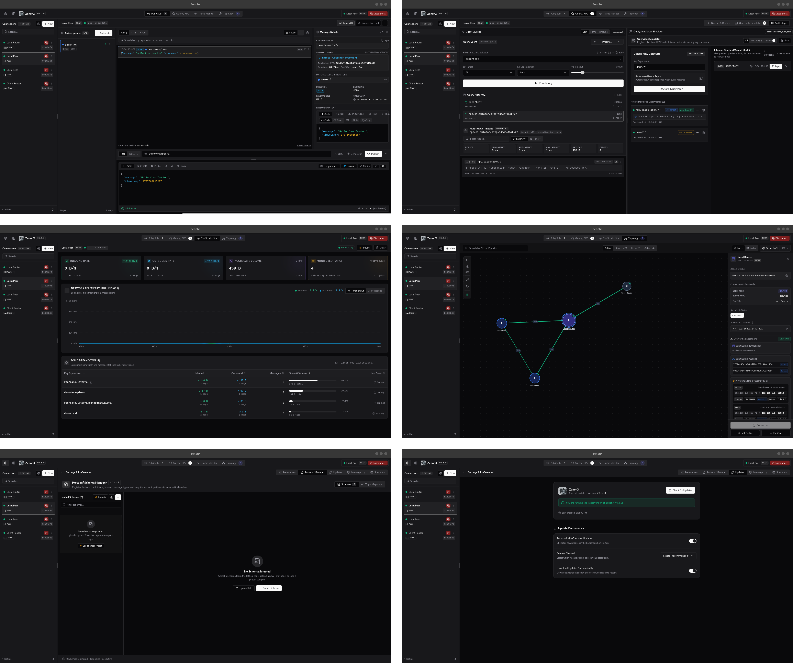

<div align="center">


# ZenohX

**Modern, high-performance desktop GUI client for Eclipse Zenoh (1.x Protocol).**

[](https://github.com/khanhdew/ZenohX/releases)
[](https://github.com/khanhdew/ZenohX/releases)
[](LICENSE)
[](https://github.com/khanhdew/ZenohX/releases)
[](https://tauri.app)

[**Download ZenohX**](https://github.com/khanhdew/ZenohX/releases/latest) • [**Features**](#features) • [**Installation**](#installation) • [**Building from Source**](#building-from-source) • [**Contributing**](#contributing)

<br/>



</div>

---

## ✨ Features

- **🚀 Real-Time Pub / Sub Streaming:**
  - Subscribe to multiple key expressions (`sensor/**`, `robot/*/telemetry`) with custom color tags and wildcard resolution.
  - Publish with **PUT** or **DELETE** sample kinds with expandable payload editor.
  - **Recent Key Expressions**: Quick-access dropdown tracking your last 5 used key expressions.
  - Direction indicators: Left border for incoming (`IN`) samples, Right border for outgoing (`OUT`) samples.
  - Virtualized message feed handling 5,000+ live samples smoothly in memory.
- **⚡ Dynamic Protocol Buffers (Protobuf) Schema Registry & Codec:**
  - **In-App Schema Manager**: Upload `.proto` files, write/edit schema definitions in real-time with instant syntax validation and code formatting (`Ctrl+Shift+P` / `Cmd+Shift+P`).
  - **Built-in Robotics & IoT Presets**: Ready-to-use starter schemas for standard payloads (`sensor_msgs.proto`, `robot_control.proto`, and `geometry_msgs.proto`).
  - **Automatic Topic-to-Schema Mapping**: Bind Zenoh key expression patterns (e.g. `robot/sensors/**`) directly to target Protobuf message decoders.
  - **Real-Time JSON ↔ Protobuf Codec**: Encode structured JSON payloads to binary Protobuf on publish/query and decode incoming binary wire payloads back to formatted JSON and interactive tree views.
  - **1-Click Sample Payload Generator**: Scaffold valid mock JSON templates from any compiled Protobuf message descriptor.
- **🔍 Distributed Query & RPC Simulator:**
  - Send queries across Zenoh routers and peers with latency tracking and multi-reply timeline.
  - **Dynamic JavaScript Script Execution**: Run custom JS logic to dynamically compute replies from URL query parameters (`query.params`, `query.keyExpr`, `query.payload`) alongside static payloads.
  - **Interactive Script Sandbox**: Test and debug your JavaScript RPC logic live before deploying.
  - Built-in templates for RPC Calculators, Dynamic Telemetry Sensors, Echo Inspectors, and Health Status endpoints.
- **📊 Traffic & Network Monitoring:**
  - Real-time throughput metrics (bytes/sec, messages/sec) and key traffic breakdown tables.
- **📡 Automatic Local LAN Multicast Scout:**
  - Discover Zenoh routers and peers announcing on UDP multicast (`224.0.0.224:7446`) with 1-click connect.
- **🔒 TLS & Mutual TLS (mTLS) Support:**
  - Connect securely over `tls/`, `tcp/`, `quic/`, and `udp/`.
  - Custom Root CA, client certificate, and private key authentication.
- **📦 Multi-Format Payload Codec & Hex Editor:**
  - Real-time viewer & editor with syntax highlighting for **JSON**, **CBOR**, **Protocol Buffers (Protobuf)**, **Plain Text**, and **RAW/Hex**.
  - Interactive tree inspector, live schema validation, and wire byte size calculations.
- **💾 Local SQLite Message Persistence:**
  - Persist historical messages to local SQLite database with full-text and hex byte search.
- **🔄 Built-in Cryptographic Auto-Updater:**
  - Seamless in-app updates verified via Minisign digital signatures.

---

## 📥 Installation

### 1. One-Liner Install Script (Fastest)

**Linux & macOS:**
```bash
curl -fsSL https://raw.githubusercontent.com/khanhdew/ZenohX/main/scripts/install.sh | bash
```

**Windows (PowerShell as Administrator or User):**
```powershell
irm https://raw.githubusercontent.com/khanhdew/ZenohX/main/scripts/install.ps1 | iex
```

---

### 2. Download Installers (GitHub Releases)

Download pre-packaged installers directly from [**GitHub Releases**](https://github.com/khanhdew/ZenohX/releases/latest):

| Operating System | Package | Install Method |
| :--- | :--- | :--- |
| **macOS** (Apple Silicon / Intel) | `.dmg` | Open `.dmg` and drag to Applications |
| **Windows** (x64) | `.msi` / `.exe` | Run installer |
| **Ubuntu / Debian / Mint** | `.deb` | `sudo dpkg -i zenohx_*_amd64.deb` |
| **RHEL / Fedora / Rocky Linux** | `.rpm` | `sudo dnf install ./zenohx-*.x86_64.rpm` |
| **Universal Linux** | `.AppImage` | `chmod +x zenohx.AppImage && ./zenohx.AppImage` |

> [!TIP]
> **First-Launch Notes for macOS & Windows:**
> - **macOS (Gatekeeper):** If macOS prevents opening the downloaded app with a verification warning, run:
>   ```bash
>   xattr -cr /Applications/ZenohX.app
>   ```
> - **Windows (SmartScreen):** If Windows Defender SmartScreen appears, click **"More info"** &rarr; **"Run anyway"**.

---

## 🛠️ Building from Source

### Prerequisites
- [Node.js](https://nodejs.org) (v18+)
- [Rust & Cargo](https://rustup.rs) (v1.75+)
- Linux system dependencies (Ubuntu/Debian):
  ```bash
  sudo apt-get update && sudo apt-get install -y \
    libwebkit2gtk-4.1-dev \
    build-essential \
    curl \
    wget \
    file \
    libssl-dev \
    libgtk-3-dev \
    libayatana-appindicator3-dev \
    librsvg2-dev
  ```

### Development Setup

```bash
# 1. Clone repository
git clone https://github.com/khanhdew/ZenohX.git
cd ZenohX

# 2. Install NPM dependencies
npm install

# 3. Run development mode (Vite + Tauri)
npm run tauri dev
```

### Production Build

```bash
npm run build
npm run tauri build
```
Binaries will be output to `src-tauri/target/release/bundle/`.

---

## 🤝 Contributing & Community

ZenohX is a Free and Open Source Software (FOSS) project. We welcome contributions, bug reports, feature requests, and community discussions!

- **🐛 Report a Bug:** Open an issue with our [Bug Report Template](https://github.com/khanhdew/ZenohX/issues/new?template=bug_report.yml).
- **💡 Suggest a Feature:** Propose ideas using our [Feature Request Template](https://github.com/khanhdew/ZenohX/issues/new?template=feature_request.yml).
- **💬 Discussions:** Join our community on [GitHub Discussions](https://github.com/khanhdew/ZenohX/discussions).
- **Pull Requests:** Check that all tests pass (`npm test`) and typechecks pass (`npx tsc --noEmit`) before submitting a PR.

---

## 🚀 Release Automation (Maintainers)

ZenohX includes an automated release workflow that handles version synchronization (`package.json`, `tauri.conf.json`, `Cargo.toml`, `Cargo.lock`), conventional changelog generation, and tag creation:

```bash
# Bump version and generate release changelog (patch: 0.2.0 -> 0.2.1)
npm run release:new -- patch

# Or minor / major / explicit version:
npm run release:new -- minor
npm run release:new -- 1.0.0

# Push changes and trigger cross-platform GitHub Actions build
git push origin main --tags
```

---

## 📄 License

Distributed under the **Apache License 2.0**. See [`LICENSE`](LICENSE) for more details.
